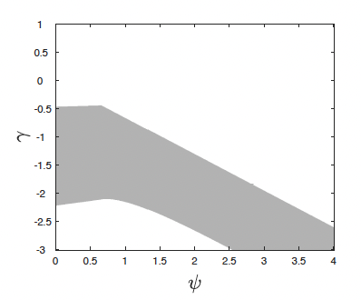
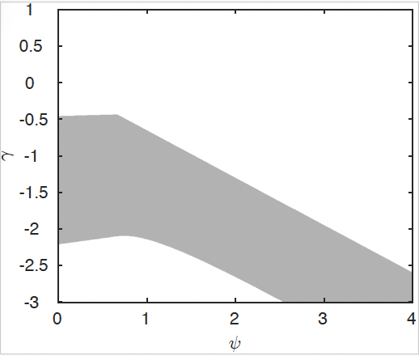
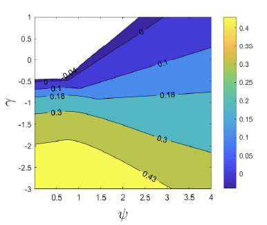
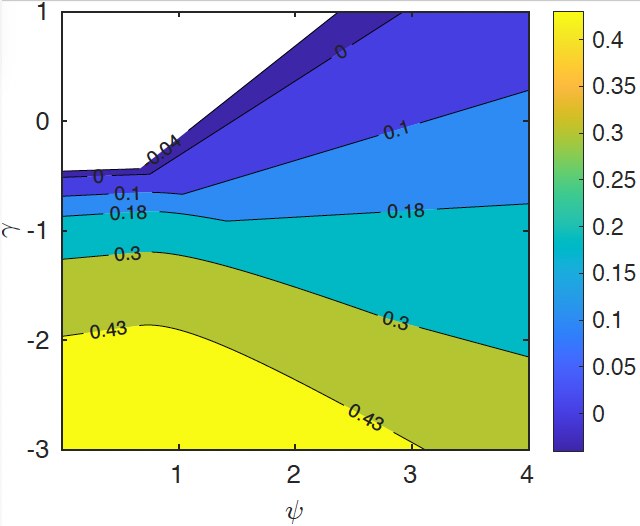
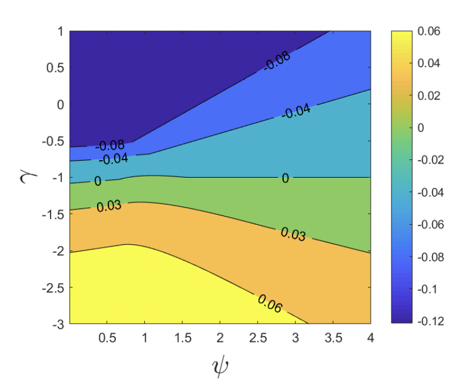
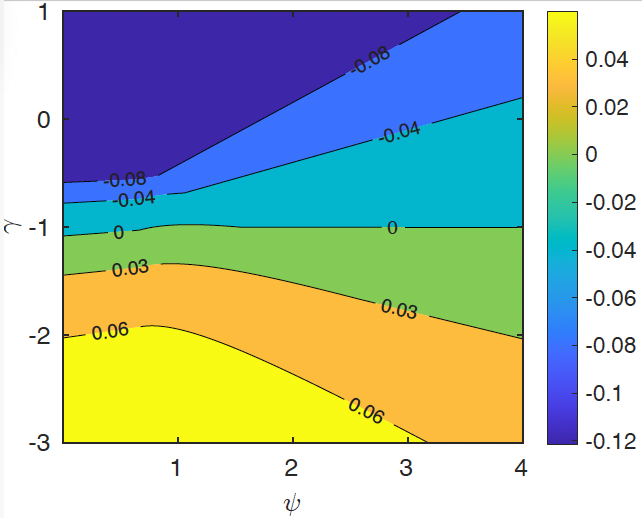

# Paper Identification

|           |                      |
|-----------|----------------------|
| ID        |  |
| Author    |    |
| Title     |     |
| Iteration |     |

# Summary

In assessing compliance with our [Data and Code Availability Policy](https://www.journals.uchicago.edu/journals/jpe/datapolicy), our reproducibility team has identified the following issues, which we ask you to address:

# General

-   [x] Data Availability and Provenance Statements
    -   [x] Statement about Rights - Part 1: Right to use the data (e.g. *did the authors lawfully obtain the data*)
    -   [x] Statement about Rights - Part 2: Right to publish the data (e.g. *are human subjects involved and did permission been granted to publish their data?*)
    -   [x] License for Data (optional, but recommended)
    -   [ ] Details on each Data Source
-   [ ] Dataset list
-   [x] Computational requirements
    -   [x] Software Requirements
    -   [ ] Controlled Randomness (as necessary)
    -   [x] Memory, Runtime, and Storage Requirements
-   [ ] Description of programs/code
    -   [ ] License for Code (Optional, but recommended)
-   [ ] List of tables and programs
-   [ ] References (Optional, but recommended)

# High-level Description of Research Project

*This research project...*

-   [ ] uses observational data.
-   [ ] uses *confidential* observational data.
-   [ ] uses data generated via experiment or trial by the authors (in field or lab).
    -   [ ] For lab experiments: The code to implement the experimental protocol (z-Tree, o-Tree etc) is included in the package.
    -   [ ] A PDF copy of IRB approval is contained in the package.
    -   [ ] A PDF document outlining the design of the experiment, including information on the selection and eligibility of participants is included.
    -   [ ] A PDF copy of the instructions given to participants in both original language and an English translation is included.
-   [ ] uses data generated via survey by the authors (in field or online)
    -   [ ] The programs used to administer the survey (e.g. qualtrics survey file) are included.
    -   [ ] A PDF copy of IRB approval is contained in the package.
    -   [ ] A PDF of the original questionaire(s) and information on the selection and eligibility of participants is included.
-   [x] is a simulation study: the data are generated by an algorithm.
-   [ ] is a numerical illustration: no data are used but code is used to produce illustrative output (tables, figures)

# Data description

## Data Sources

# Requirements

-   [x] README is in TXT, MD, or PDF format
-   [x] README is accessible at the root of the package (not inside a folder)
-   [ ] Title conforms to guidance (starts with "Data and Code for: Title of Paper" or "Code for: Title of Paper", is properly capitalized)
-   [ ] Authors (with affiliations) are listed in the same order as on the paper

> {REQUIRED} Please review the title of the deposit as per our guidelines.

> {REQUIRED} Please review authors and affiliations on the deposit. In general, they are the same, and in the same order, as for the manuscript; however, authors can deviate from that order.

## Stated Requirements

-   [ ] No requirements specified
-   [x] Software Requirements specified as follows:
    -   Windows, macOS, or Linux
    -   MATLAB (recommended R2021b or later)
-   [x] Computational Requirements specified as follows:
    -   Standard desktop/laptop CPU; no GPU required
-   [x] Time Requirements specified as follows:
    -   Full run from source code to all outputs: approximately 2-10 minutes on a typical modern laptop
-   [x] Requirements are complete.

# Analyzing Data and Code Files











## Code description

There are 3 provided Matlab .m files. There's one .ps1 file that was used to zip the replication package.



-   [x] The replication package contains a "main" or "master" file(s) which calls all other auxiliary programs.

## Computing Environment of the Replicator

-   Nuvolos, Linux, 4 vCPU, 16 GB RAM
-   Matlab R2024b

# Replication

-   Downloaded code and data from dropbox and git repo using Nuvolos jpe-template.
-   Ran code as per README.
-   Code ran successfully.

# Findings {#sec-findings}

## Data Preparation Code

-   Program `run_all.m` that ran `Figure1.m` and `Figure2.m` ran without issues reproducing all results.

## Tables and Figures

| In-text numbers | Program | Line Number | Reproduced? |
| :--- | :--- | :--- | :--- |
| tau=1 | Figure1.m | 2 | Yes |
| tau_e=1 | Figure1.m | 3 | Yes |
| tau_eta=1 | Figure1.m | 4 | Yes |
| deltah=4 | Figure1.m | 5 | Yes |
| psi=0 | Figure1.m | 9 | Yes |
| chi=1 | Figure1.m | 10 | Yes |
| tau=1 | Figure2.m | 2 | Yes |
| tau_eta=1 | Figure2.m | 2 | Yes |
| tau_e=1 | Figure2.m | 2 | Yes |
| deltal=0.55 | Figure2.m | 3 | Yes |
| rho=0 | Figure2.m | 8 | Yes |

| Figure/Table # | Program | Line Number | Reproduced? |
| :--- | :--- | :--- | :--- |
| Figure 1 | Figure1.m | 66 | Yes |
| Figure 2 | Figure2.m | 119 | Yes |

-   Figure 1: Looks the same.
-   Figure 2: Panels (a), (b) and (c) have different x-ticks in the reproduced version. Panels (b) and (c) also y-ticks. Legend in panel (c) is lacking the maximum value of 0.06. Panels (b) and (c) in the replicated version display the number on the most bottom curve twice, i.e. 0.43 and 0.06 in panel (b) and (c) respectively. In the original, it appears only once.

::: {#fig-two-a layout-ncol="2"}

:::

::: {#fig-two-b layout-ncol="2"}

:::

::: {#fig-two-c layout-ncol="2"}

:::

## In-Text Numbers

-   [x] In-text numbers not verified.

-   [ ] There are no in-text numbers, or all in-text numbers stem from tables and figures.

-   [ ] There are in-text numbers, but they are not identified in the code

## Other Issues

-   There's an additional folder that is `JPE_data_replication` inside `replication-package`. Please make sure all the content is directly in the `replication-package` folder.
-   Paper and appendix are in one pdf file. Please separate them.
-   Memory and storage requirements not stated. CPU requirements as "Standard desktop/laptop CPU"; it only needs to plot static figures in matlab, so it's justifable? @jpedataeditor
-   Missing list of tables and programs. Please move the description of the scripts from code folder to README.md in the replication-package folder.

# Classification

-   [ ] full reproduction
-   [x] full reproduction with minor issues
-   [ ] partial reproduction (see above)
-   [ ] not able to reproduce most or all of the results (reasons see above)

## Reason for incomplete reproducibility

-   [ ] None.
-   [x] `Discrepancy in output` (either figures or numbers in tables or text differ)
-   [ ] `Bugs in code` that were fixable by the replicator (but should be fixed in the final deposit)
-   [ ] `Code missing`, in particular if it prevented the replicator from completing the reproducibility check
    -   [ ] `Data preparation code missing` should be checked if the code missing seems to be data preparation code
-   [ ] `Code not functional` is more severe than a simple bug: it prevented the replicator from completing the reproducibility check
-   [ ] `Software not available to replicator` may happen for a variety of reasons, but in particular (a) when the software is commercial, and the replicator does not have access to a licensed copy, or (b) the software is open-source, but a specific version required to conduct the reproducibility check is not available.
-   [ ] `Insufficient time available to replicator` is applicable when (a) running the code would take weeks or more (b) running the code might take less time if sufficient compute resources were to be brought to bear, but no such resources can be accessed in a timely fashion (c) the replication package is very complex, and following all (manual and scripted) steps would take too long.
-   [ ] `Data missing` is marked when data *should* be available, but was erroneously not provided, or is not accessible via the procedures described in the replication package
-   [ ] `Data not available` is marked when data requires additional access steps, for instance purchase or application procedure.
-   [ ] `Missing README` is marked if there is no README to guide the replicator, or the README is not in compliance with JPE requirements